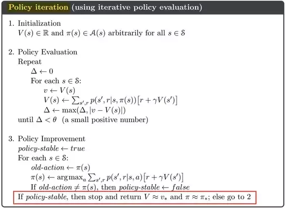
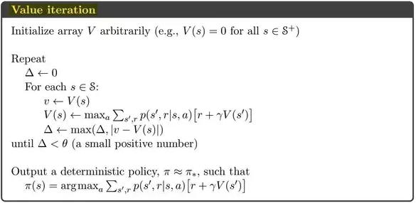
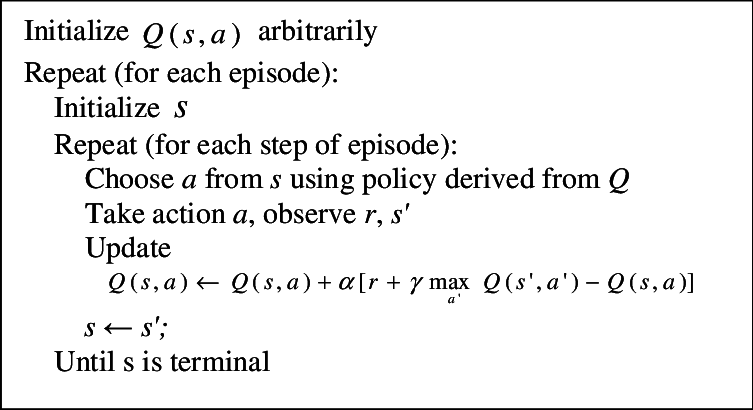

# Implementation for Reinforcement Learning Algorithms 
### Model Based Algorithms

- [Policy Iteration](scripts/Policy_iteration.py)

- [Value Iteration](scripts/Value_iteration.py)

### Value Based Algorithm
- [Q-Learning](scripts/Q_Learning.py)

- DQN
